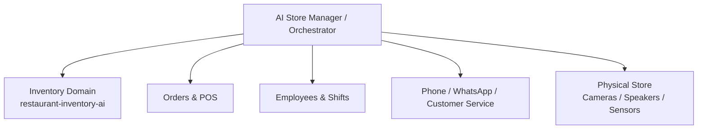

# AI Store Manager — Product Vision

## Vision

The long-term goal is to build an **AI operations manager for physical food businesses**.

The system should not be a chatbot attached to a store. It should be an operational agent that can understand what is happening in the business, communicate with customers and employees, use business systems, and take narrowly defined actions with clear auditability and human oversight.

The first real-world pilot is intended to be a food shop, allowing development to be driven by actual operational problems rather than hypothetical requirements.

---

## Where This Repository Fits

`restaurant-inventory-ai` is the **Inventory domain** of the larger AI Store Manager system.

It owns the source of truth for:

- Products and product variants
- Current stock levels
- Stock movements
- Waste and adjustments
- Minimum stock thresholds
- Inventory history and audit trail
- Future supplier and purchase-order data
- Future demand forecasting and replenishment recommendations

The repository should remain useful independently of the AI system. Inventory rules must be deterministic and testable; an LLM must never become the source of truth for stock.

---

## System Direction



The AI Store Manager should interact with domains through explicit tools/contracts rather than direct database access.

Example inventory tools:

```text
inventory.search_products(query)
inventory.get_stock(product_id)
inventory.get_low_stock()
inventory.receive_stock(...)
inventory.consume_stock(...)
inventory.record_waste(...)
inventory.adjust_stock(...)
inventory.get_movements(...)
```

---

## Core Product Capabilities

### 1. Inventory Manager

The first and most mature domain.

Responsibilities:

- Track stock accurately
- Record deliveries, consumption, waste and corrections
- Maintain an audit trail
- Detect low stock
- Help prepare supplier orders
- Later predict shortages and demand

### 2. AI Receptionist / Customer Service

Future capabilities:

- Answer phone calls in Hebrew
- Handle WhatsApp or web conversations
- Answer menu, price and opening-hours questions
- Take customer orders
- Check order status
- Escalate to a human when required

### 3. AI Shift Manager

Future capabilities:

- Know who is currently working
- Assign operational tasks
- Follow up on unfinished tasks
- Detect operational issues
- Communicate through store speakers or employee devices
- Produce shift summaries

The system should assist workers and managers rather than become an opaque employee-surveillance system.

### 4. Physical Store Awareness

Future camera/sensor integration may generate events such as:

- Customer waiting unusually long
- Queue growing
- Station left unattended
- Delivery arriving
- Storage area requiring attention

Continuous raw video should not normally be sent to an LLM. Prefer local/edge detection and send relevant events or snapshots for higher-level reasoning.

### 5. Loss Prevention

Loss prevention should be a separate capability and should correlate multiple signals, for example POS events and camera events.

The system should surface anomalies for review rather than automatically accuse customers or employees of theft.

---

## AI Safety and Control Principles

### Inventory Golden Rule

**If the AI is not sufficiently certain about the product, quantity, unit or requested operation, it must clarify before changing stock.**

This extends the original project rule and remains fundamental.

### Tool-Based Actions

The AI should never manipulate PostgreSQL directly.

Correct:

```text
User / event
    ↓
AI reasoning
    ↓
Validated inventory tool
    ↓
Inventory business logic
    ↓
Repository / transaction
    ↓
PostgreSQL
```

### Audit Everything Important

Operational actions should record, when applicable:

- What happened
- When it happened
- Who physically performed it
- Who/system reported it
- Why it happened
- Which automated agent/tool initiated the action

### Human Handoff

The AI must be able to stop and request human input when confidence is low, a policy prevents automation, or the consequence of an incorrect action is significant.

---

## Architecture Strategy

### Keep the MVP Simple

The existing decision to start as a Go monolith remains valid.

Do not introduce microservices merely because the long-term product contains multiple domains. Keep clean boundaries inside the application first and split services only when deployment, scaling, ownership or reliability requirements justify it.

Near-term inventory flow:

```text
HTTP API / future AI tools
          ↓
    Inventory Service
          ↓
      Repository
          ↓
      PostgreSQL
```

The existing simple REST API is not considered a mistake. It was an intentional MVP/learning step. The service layer should be introduced as business rules become richer.

---

## Development Roadmap

### Phase 1 — Reliable Inventory Core

- Complete stock endpoints
- Persist stock movements
- Ensure important stock changes are auditable
- Add inventory service/business logic
- Improve error propagation
- Add service and integration tests
- Support inventory synchronization/counting

### Phase 2 — Real Store Pilot

- Load real products
- Mobile-friendly inventory UI
- Hebrew-first experience
- Test receiving stock, consumption, waste and corrections in daily operation
- Measure inventory accuracy and usability

### Phase 3 — Inventory AI

- Natural-language stock queries
- Product matching
- Clarification flow
- Tool calling into the inventory service
- Low-stock summaries
- Suggested purchase lists

### Phase 4 — AI Store Manager MVP

Build the first cross-domain agent around a small set of high-value capabilities:

- Hebrew AI phone/customer interaction
- Order intake
- Inventory access
- Simple employee/task awareness
- Store announcements
- Human handoff
- Operational event history

### Phase 5 — Store Intelligence

- POS integrations
- Supplier integrations
- Demand forecasting
- Camera/event processing
- Shift management
- Optional loss-prevention module
- Multi-location support

---

## Product Principle

The goal is not to automate everything immediately.

The goal is to progressively build an AI system that can **observe → understand → use trusted tools → act → verify → escalate when necessary**.

Every new capability should demonstrate measurable operational value before adding more autonomy or complexity.
