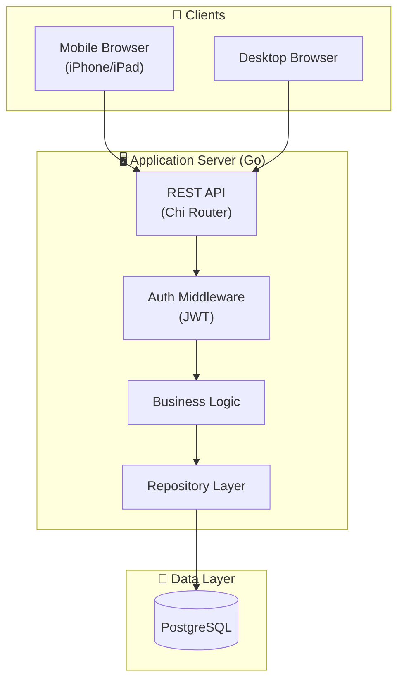
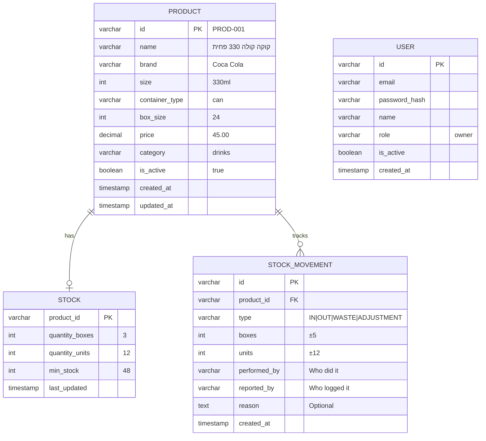

# 🏗️ System Architecture (MVP)

## Overview

**Architecture Pattern:** Monolithic application (for now)
**Reason:** Simpler to build, debug, and deploy for MVP

Future: Can split into microservices when scaling requirements emerge.

---

## High-Level Architecture (Current/MVP)



## Request Flow

```mermaid
sequenceDiagram
    participant Client
    participant API
    participant Auth
    participant Service
    participant DB as PostgreSQL

    Client->>API: POST /api/products
    API->>Auth: Validate JWT token
    Auth-->>API: User verified
    API->>Service: CreateProduct(data)
    Service->>Service: Validate input
    Service->>DB: INSERT INTO products
    DB-->>Service: Product created
        uuid id PK
    Service-->>API: Success response
    API-->>Client: 201 Created + product data
```

---

## Data Model (Current Implementation)



### Key Design Decisions

1. **Product = Unique Variant**
   - "Coca Cola 330ml Can" is ONE product
   - "Coca Cola 1.5L Plastic" is DIFFERENT product
   - No complex nested variants

2. **Stock Tracking: Boxes + Units**
   - `quantity_boxes`: Full, unopened boxes
   - `quantity_units`: Loose items from opened box
   - Total = (boxes × box_size) + units

3. **Movement Audit Trail**
   - Every change logged
   - `performed_by`: WHO did the physical action
   - `reported_by`: WHO logged it in system
   - Enables accountability

---

## Project Structure

```
restaurant-inventory-ai/
├── cmd/
│   └── server/
│       └── main.go                 # Application entry point
├── internal/
│   ├── api/
│   │   └── api.go                  # HTTP handlers
│   ├── models/
│   │   └── product.go              # Data structures
│   ├── repository/
│   │   ├── repository.go           # Interface
│   │   ├── memory_store.go         # In-memory (testing)
│   │   └── postgres_store.go       # PostgreSQL implementation
│   └── service/
│       └── service.go              # Business logic (future)
├── config/
│   └── config.go                   # Configuration loading
├── migrations/
│   ├── 001_create_products_table.sql
│   └── 002_create_stock_tables.sql
├── docs/
│   ├── REQUIREMENTS.md
│   ├── ARCHITECTURE.md             # This file
│   ├── DATA_MODELS_FINAL.md
│   └── DECISIONS.md
├── learn/                          # Learning exercises
│   └── 01_basics/
├── .env                            # Environment variables
├── docker-compose.yml              # PostgreSQL setup
├── go.mod
└── README.md
```

---

## Tech Stack (MVP)

| Layer | Technology | Why |
|-------|------------|-----|
| **Language** | Go 1.21+ | Fast, simple, great for APIs |
| **Web Framework** | Chi | Lightweight router, middleware support |
| **Database** | PostgreSQL 16 | Reliable, ACID transactions |
| **ORM** | None (raw SQL) | Learn SQL, full control, no magic |
| **Auth** | JWT | Stateless, standard |
| **Frontend** | HTML + JS (or React) | Simple start, can upgrade later |
| **Deployment** | Docker + VPS | Simple and cheap for MVP |

---

## API Endpoints (Current)

### Products

```
GET    /products              # List all products
GET    /products/:id          # Get one product
POST   /products              # Create product
PUT    /products/:id          # Update product
DELETE /products/:id          # Delete product (soft delete)
```

### Stock

```
GET    /stock/:productId      # Get stock for product
PUT    /stock/:productId      # Update stock (add/remove)
```

### Movements (Future)

```
GET    /movements             # List all movements
GET    /movements/:productId  # Movements for product
POST   /movements             # Create movement
```

### Auth (Future)

```
POST   /auth/login            # Login
POST   /auth/register         # Register (owner only initially)
POST   /auth/logout           # Logout
GET    /auth/me               # Current user info
```

---

## Deployment Architecture (MVP)

```
┌─────────────────────────────────────────┐
│  Domain: inventory.restaurant.com       │
└─────────────────────────────────────────┘
              ↓ HTTPS
┌─────────────────────────────────────────┐
│  Nginx (Reverse Proxy + SSL)            │
└─────────────────────────────────────────┘
              ↓
┌─────────────────────────────────────────┐
│  Go Application (Port 8080)             │
│  - Serves API                           │
│  - Serves static files (HTML/JS/CSS)    │
└─────────────────────────────────────────┘
              ↓
┌─────────────────────────────────────────┐
│  PostgreSQL (Port 5432)                 │
│  - Local or managed (DigitalOcean DB)   │
└─────────────────────────────────────────┘
```

### Deployment Option 1: Single VPS

**Provider:** DigitalOcean, Linode, Hetzner
**Cost:** ~$6-12/month
**Setup:**
```bash
# Install Go, PostgreSQL, Nginx
# Deploy binary
# Run as systemd service
```

**Pros:** Simple, cheap, full control
**Cons:** Manual updates, no auto-scaling

### Deployment Option 2: Docker Compose

```yaml
version: '3.8'
services:
  app:
    image: restaurant-inventory:latest
    ports:
      - "8080:8080"
    depends_on:
      - postgres
    environment:
      - POSTGRES_HOST=postgres
  
  postgres:
    image: postgres:16
    volumes:
      - pgdata:/var/lib/postgresql/data
    environment:
      - POSTGRES_PASSWORD=secret
```

**Pros:** Easy to deploy, reproducible
**Cons:** Still needs server management

### Deployment Option 3: Platform as a Service

**Provider:** Railway.app, Render.com, Fly.io
**Cost:** Free tier available, then ~$5-10/month
**Setup:** Connect Git repo, auto-deploy on push

**Pros:** Easiest, auto-deployments, SSL included
**Cons:** Less control, vendor lock-in

### Deployment Option 4: Kubernetes (Future)

For learning purposes, can deploy to:
- Minikube (local)
- k3s (lightweight K8s)
- DigitalOcean Kubernetes
- Google GKE free tier

**When:** After MVP works, for learning K8s concepts

---

## Future Evolution Path

### Phase 2: Add Microservices Gradually

```
Current (Monolith):
┌────────────────────┐
│  Single Go App     │
│  - API             │
│  - Business Logic  │
└────────────────────┘
        ↓
┌────────────────────┐
│  PostgreSQL        │
└────────────────────┘

Future (Microservices):
┌────────────────────┐     ┌────────────────────┐
│  Inventory Service │     │  AI Service        │
│  (Go)              │     │  (Go/Python)       │
└────────────────────┘     └────────────────────┘
        ↓                          ↓
┌────────────────────┐     ┌────────────────────┐
│  PostgreSQL        │     │  Vector DB         │
└────────────────────┘     └────────────────────┘
```

### Phase 3: Add Advanced Features

- AI chat interface
- RAG for product matching
- Smart suggestions
- Mobile app (React Native/Flutter)
- Offline-first PWA

---

## Development Workflow

### Local Development

```bash
# Terminal 1: Start PostgreSQL
docker-compose up postgres

# Terminal 2: Run migrations
# (migrations run automatically on startup)

# Terminal 3: Run server
export $(cat .env | xargs)
go run cmd/server/main.go

# Terminal 4: Test API
curl http://localhost:8080/products
```

### Testing

```bash
# Run unit tests
go test ./internal/models/

# Run integration tests
go test ./internal/repository/ -tags=integration

# Run all tests
go test ./...
```

### Database Migrations

Migrations in `migrations/` folder run automatically via docker-entrypoint.
For manual migrations:
```bash
psql -h localhost -U postgres -d inventory -f migrations/001_xxx.sql
```

---

## Security Considerations (Future)

### MVP (Basic)
- ✅ HTTPS only (via Nginx or platform)
- ✅ Password hashing (bcrypt)
- ✅ JWT tokens
- ✅ SQL injection prevention (parameterized queries)
- ✅ CORS configuration

### Production (Enhanced)
- Rate limiting
- Input validation
- CSRF protection
- Security headers
- Regular updates
- Monitoring and logging
- Database backups

---

## Monitoring & Logging (Future)

### MVP
- Application logs to stdout
- PostgreSQL logs
- Nginx access/error logs

### Production
- Structured logging (JSON)
- Centralized logging (Loki, ELK)
- Metrics (Prometheus)
- Alerting (when errors spike)
- Uptime monitoring

---

## Why Start Simple?

**Philosophy:** Build MVP first, add complexity when needed.

**Benefits:**
1. ✅ Faster time to production
2. ✅ Easier to debug
3. ✅ Cheaper to run
4. ✅ Learn basics before advanced patterns
5. ✅ Real user feedback early

**When to Add Complexity:**
- Microservices: When scaling or team structure requires it
- Caching: When database queries become slow
- Message queues: When async processing needed
- AI features: When core features work well

---

## Summary

**Current State:** Monolithic Go application with PostgreSQL
**Goal:** Working MVP in 4-6 weeks
**Future:** Can evolve into microservices architecture with AI capabilities

**Next Steps:**
1. ✅ Complete REST API (Products, Stock, Movements)
2. ⬜ Add authentication (Users, JWT)
3. ⬜ Build web interface (HTML + JS or React)
4. ⬜ Deploy to production
5. ⬜ Get real user feedback
6. ⬜ Iterate based on usage
