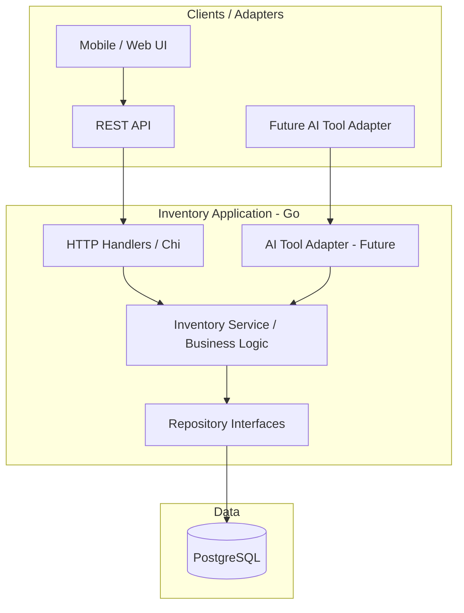
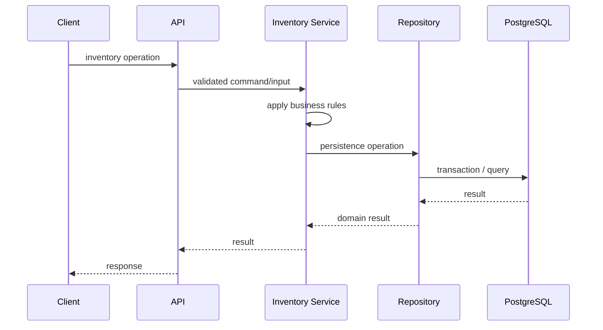
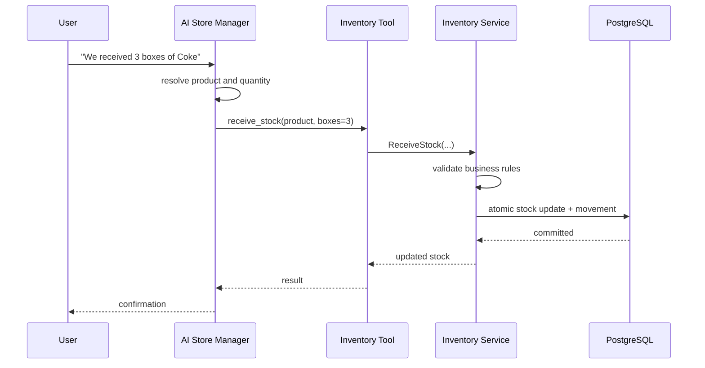
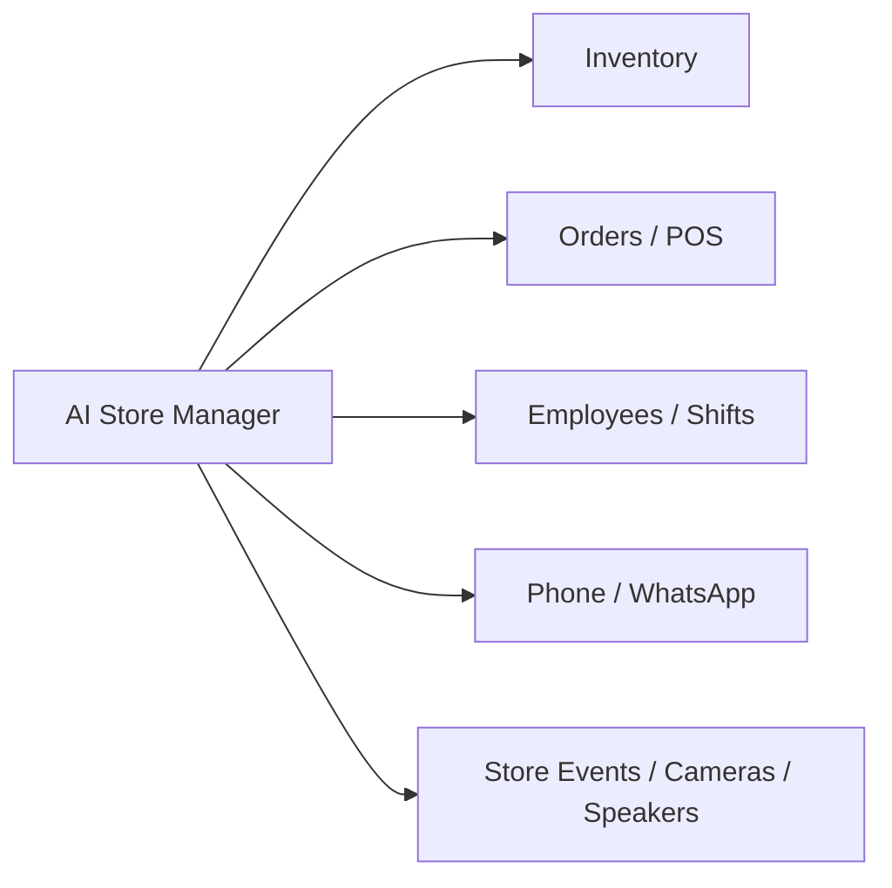

# 🏗️ Inventory System Architecture

## Overview

**Current architecture:** Modular monolith in Go

**Reason:** Keep the inventory MVP simple to build, debug, test and deploy while preserving clean domain boundaries for future integrations.

This repository is the **Inventory domain** of a larger long-term product vision: **AI Store Manager**. The inventory application must remain independently useful and deterministic. AI systems consume inventory capabilities through explicit APIs/tools; they do not own inventory state or access the database directly.

See [`AI_STORE_MANAGER_VISION.md`](./AI_STORE_MANAGER_VISION.md) for the broader product direction.

---

## Architecture Principles

1. **Start simple.** Do not introduce distributed systems without a concrete need.
2. **Inventory is the source of truth for inventory.** LLM state is never authoritative stock state.
3. **Business rules belong in the service/domain layer.** HTTP handlers and future AI tools are adapters.
4. **Persistence is hidden behind repository interfaces.**
5. **Important stock changes are auditable.**
6. **AI actions use the same validated business operations as human/API actions.**
7. **Split into services only when scaling, deployment, reliability or ownership requirements justify it.**

---

## Current / Near-Term Architecture


```mermaid
flowchart TB
    subgraph Clients[Clients / Adapters]
        Mobile[Mobile / Web UI]
        HTTP[REST API]
        FutureAI[Future AI Tool Adapter]
    end

    subgraph App[Inventory Application - Go]
        API[HTTP Handlers / Chi]
        Tools[AI Tool Adapter - Future]
        Service[Inventory Service / Business Logic]
        Repo[Repository Interfaces]
    end

    subgraph Data[Data]
        PostgreSQL[(PostgreSQL)]
    end

    Mobile --> HTTP
    HTTP --> API
    FutureAI --> Tools
    API --> Service
    Tools --> Service
    Service --> Repo
    Repo --> PostgreSQL
```

### Current Implementation Note

The first MVP intentionally implemented a simple `API → Repository` path for product CRUD. This was useful for learning and for getting a working vertical slice quickly.

As inventory behavior becomes richer, the application evolves toward:

```text
HTTP / AI tools
      ↓
Inventory Service
      ↓
Repository
      ↓
PostgreSQL
```

This is an incremental evolution, not a rewrite requirement.

---

## Request / Action Flow

A normal API request:


```mermaid
sequenceDiagram
    participant Client
    participant API
    participant Service as Inventory Service
    participant Repo as Repository
    participant DB as PostgreSQL

    Client->>API: inventory operation
    API->>Service: validated command/input
    Service->>Service: apply business rules
    Service->>Repo: persistence operation
    Repo->>DB: transaction / query
    DB-->>Repo: result
    Repo-->>Service: domain result
    Service-->>API: result
    API-->>Client: response
```

A future AI action follows the same business path:


```mermaid
sequenceDiagram
    participant User
    participant Agent as AI Store Manager
    participant Tool as Inventory Tool
    participant Service as Inventory Service
    participant DB as PostgreSQL

    User->>Agent: "We received 3 boxes of Coke"
    Agent->>Agent: resolve product and quantity
    Agent->>Tool: receive_stock(product, boxes=3)
    Tool->>Service: ReceiveStock(...)
    Service->>Service: validate business rules
    Service->>DB: atomic stock update + movement
    DB-->>Service: committed
    Service-->>Tool: updated stock
    Tool-->>Agent: result
    Agent-->>User: confirmation
```

If product, quantity, unit or operation is ambiguous, the AI must clarify before performing a stock mutation.

---

## Inventory Domain Model

### Product

A product represents one concrete sellable/stockable variant.

Examples:

- Coca Cola 330ml can
- Coca Cola 1.5L bottle
- Coca Cola Zero 330ml can

These are separate products rather than variants hidden inside one product object.

### Stock

Tracks the current inventory level for a product.

For boxed goods:

```text
total units = quantity_boxes × box_size + quantity_units
```

The domain can later evolve to support weighted goods, batches and expiration dates without requiring the AI layer to understand persistence details.

### Stock Movement

Every meaningful inventory change should become an auditable movement.

Movement types currently include:

```text
IN
OUT
WASTE
ADJUSTMENT
```

Important metadata includes:

- product
- quantity change
- movement type
- who physically performed the action
- who/system reported the action
- reason
- timestamp

Future metadata may include source system, AI agent/tool invocation ID, supplier/order reference and location.

---

## Inventory Operations

Prefer domain-oriented operations over exposing arbitrary database-style updates.

Target service operations include:

```text
SearchProducts(query)
GetStock(productID)
GetLowStock()
ReceiveStock(...)
ConsumeStock(...)
RecordWaste(...)
AdjustStock(...)
GetMovements(...)
SynchronizeInventory(...)
```

These operations can later be exposed as REST endpoints, internal calls, or AI tools while sharing the same validation and transaction logic.

---

## API Direction

### Products

```text
GET    /products
GET    /products/:id
POST   /products
PUT    /products/:id
DELETE /products/:id
```

### Stock

```text
GET    /stock/:productId
GET    /stock/low
```

### Stock Operations / Movements

```text
POST   /movements
GET    /movements
GET    /movements/:productId
```

The exact external API may evolve. The important contract is the inventory service/domain behavior beneath it.

### Authentication

Future:

```text
POST   /auth/login
POST   /auth/register
POST   /auth/logout
GET    /auth/me
```

Authorization will later distinguish owners, managers, employees and trusted system/agent identities.

---

## Relationship to AI Store Manager

The larger system is expected to contain multiple bounded domains/capabilities:


```mermaid
flowchart LR
    Agent[AI Store Manager]
    Inventory[Inventory]
    Orders[Orders / POS]
    Employees[Employees / Shifts]
    Comms[Phone / WhatsApp]
    Physical[Store Events / Cameras / Speakers]

    Agent --> Inventory
    Agent --> Orders
    Agent --> Employees
    Agent --> Comms
    Agent --> Physical
```

This repository owns **Inventory**.

It should not grow into a single codebase containing telephony, computer vision, employee scheduling and every future AI Store Manager capability merely because those capabilities interact with stock.

The orchestrating AI can combine information from multiple domains while each domain retains ownership of its own rules and data.

---

## AI Integration Contract

The future AI layer should receive narrow, explicit tools such as:

```text
inventory.search_products(query)
inventory.get_stock(product_id)
inventory.get_low_stock()
inventory.receive_stock(...)
inventory.consume_stock(...)
inventory.record_waste(...)
inventory.adjust_stock(...)
inventory.get_movements(...)
```

The AI must **not** receive unrestricted SQL/database access.

Benefits:

- deterministic validation
- authorization boundaries
- auditability
- easier testing
- safer AI behavior
- ability to replace the AI model without changing inventory rules

---

## Deployment Strategy

### MVP

Keep deployment inexpensive and understandable:

```text
HTTPS
  ↓
Go inventory application
  ↓
PostgreSQL
```

Docker Compose or a small managed platform/VPS is sufficient for the early pilot.

### Later

Do not move to Kubernetes or microservices solely for architectural purity.

Consider splitting components when there is a concrete reason such as:

- independent scaling requirements
- separate deployment lifecycle
- reliability/isolation requirements
- multiple development teams
- high-volume asynchronous processing
- physical-store edge workloads

The AI Store Manager orchestrator may naturally become a separate service before the inventory domain itself needs further decomposition.

---

## Testing Strategy

### Domain / Service Tests

Test inventory rules without HTTP or PostgreSQL when possible.

Examples:

- cannot consume more stock than available
- ambiguous/invalid quantities rejected
- receiving stock increases correct totals
- waste produces correct movement
- adjustment requires appropriate reason/actor rules

### Repository Integration Tests

Verify PostgreSQL behavior and transaction semantics.

### API Tests

Verify HTTP mapping, validation and status codes.

### Future AI Contract Tests

AI tests should verify that natural-language requests resolve into safe tool calls. Inventory correctness itself remains covered by deterministic service tests.

---

## Near-Term Roadmap

### Phase 1 — Reliable Inventory Core

- Complete stock operations
- Persist stock movements
- Introduce inventory service/business logic where needed
- Ensure stock mutations and movement records are atomic
- Improve repository error propagation
- Add service tests
- Add inventory synchronization/counting flow

### Phase 2 — Real Store Pilot

- Load real product catalog
- Mobile-friendly UI
- Hebrew-first experience
- Use the system for deliveries, consumption, waste and inventory counts
- Measure accuracy and operational friction

### Phase 3 — Inventory AI

- Natural-language inventory queries
- Product matching
- clarification flow
- inventory tool calling
- low-stock summaries
- suggested purchase lists

### Phase 4 — AI Store Manager Integration

Connect this domain to the broader orchestrator described in `AI_STORE_MANAGER_VISION.md`.

---

## Why Keep It Simple?

The original project philosophy remains valid:

> Build the simplest system that solves the real operational problem, then add complexity only when reality requires it.

The new AI Store Manager vision expands the destination, but it does not invalidate the MVP architecture that got the project started.

---

## Summary

**Today:** Go + PostgreSQL inventory application with product CRUD and repository abstractions.

**Next:** Strengthen stock operations, movements and the service/domain boundary.

**Long term:** This repository becomes the trusted Inventory capability used by the AI Store Manager and other store systems.
