# 🏗️ System Architecture

## High-Level Architecture

```mermaid
flowchart TB
    subgraph Clients["📱 Clients"]
        Mobile["Mobile App<br/>(iPhone/iPad)"]
        Web["Web Browser"]
    end

    subgraph Gateway["🚪 API Gateway"]
        Auth["Authentication<br/>& Authorization"]
        Router["Request Router"]
    end

    subgraph AI["🤖 AI Layer"]
        Chat["Chat Interface"]
        RAG["RAG Engine<br/>(Context-Aware AI)"]
        LLM["LLM Provider<br/>(Ollama/OpenAI)"]
    end

    subgraph Services["⚙️ Microservices"]
        InvService["📦 Inventory<br/>Service"]
        WorkService["👥 Workforce<br/>Service"]
        AlertService["🔔 Alert<br/>Service"]
        ReportService["📊 Report<br/>Service"]
    end

    subgraph Data["💾 Data Layer"]
        PostgreSQL[(PostgreSQL<br/>Main DB)]
        Redis[(Redis<br/>Cache)]
        VectorDB[(Vector DB<br/>Embeddings)]
    end

    subgraph MCP["🔌 MCP Servers (Future)"]
        MCPInventory["Inventory MCP"]
        MCPWorkforce["Workforce MCP"]
        MCPCalendar["Calendar MCP"]
    end

    Mobile --> Gateway
    Web --> Gateway
    Gateway --> Auth
    Auth --> Router
    Router --> AI
    Router --> Services
    AI --> RAG
    RAG --> LLM
    RAG --> VectorDB
    Chat --> RAG
    InvService --> PostgreSQL
    WorkService --> PostgreSQL
    AlertService --> Redis
    Services --> Data
    AI -.-> MCP
```



## User Flow - Main Interactions

```mermaid
flowchart LR
    subgraph User["👤 User Actions"]
        A["Open App"]
        B["Chat or Browse"]
    end

    subgraph ChatFlow["💬 Chat Flow"]
        C1["Ask Question"]
        C2["AI Understands Intent"]
        C3["AI Executes Action"]
        C4["Shows Result"]
    end

    subgraph VisualFlow["👁️ Visual Flow"]
        V1["Open Dashboard"]
        V2["See Stock/Schedule"]
        V3["Click to Edit"]
        V4["Changes Saved"]
    end

    A --> B
    B -->|"Chat"| C1 --> C2 --> C3 --> C4
    B -->|"Browse"| V1 --> V2 --> V3 --> V4
```



## Inventory Data Model


## Workforce Data Model


## User & Access Control


## Chat/AI Flow

```mermaid
sequenceDiagram
    participant U as 👤 User
    participant C as 💬 Chat UI
    participant AI as 🤖 AI Engine
    participant RAG as 📚 RAG
    participant API as ⚙️ Services
    participant DB as 💾 Database

    U->>C: "What should I order this week?"
    C->>AI: Process message
    AI->>RAG: Get relevant context
    RAG->>DB: Query current stock levels
    RAG->>DB: Query historical usage
    RAG-->>AI: Context: low stock items, usage patterns
    AI->>AI: Generate recommendation
    AI-->>C: "Based on stock levels, order:<br/>- 5 boxes Cola (only 2 left)<br/>- 3 boxes Flour (weekend coming)"
    C-->>U: Display recommendation
    U->>C: "Create the order"
    C->>AI: Action intent detected
    AI->>API: Create purchase order
    API->>DB: Save order
    API-->>AI: Order #1234 created
    AI-->>C: "Order #1234 created. Send to supplier?"
    C-->>U: Show confirmation
```



## Microservices Boundaries


## MCP Integration (Future)

```mermaid
flowchart LR
    subgraph "AI Assistant"
        LLM["LLM<br/>(Claude/GPT)"]
    end
    
    subgraph "MCP Servers"
        MCP1["📦 Inventory MCP<br/>- Check stock<br/>- Add stock<br/>- Create order"]
        MCP2["👥 Workforce MCP<br/>- Get schedule<br/>- Assign shift<br/>- Check availability"]
        MCP3["📅 Calendar MCP<br/>- Get holidays<br/>- Mark busy days"]
    end
    
    subgraph "Backend Services"
        API["REST API"]
        DB[(Database)]
    end
    
    LLM <-->|"MCP Protocol"| MCP1
    LLM <-->|"MCP Protocol"| MCP2
    LLM <-->|"MCP Protocol"| MCP3
    MCP1 --> API
    MCP2 --> API
    MCP3 --> API
    API --> DB
```



---

## Technology Stack

| Layer | Technology | Why |
|-------|------------|-----|
| **Backend** | Go | Fast, simple, great for APIs |
| **Database** | PostgreSQL | Reliable, feature-rich |
| **Cache** | Redis | Fast sessions, rate limiting |
| **Vector DB** | pgvector | Embeddings in PostgreSQL |
| **AI/LLM** | Ollama → OpenAI | Local dev, cloud prod |
| **Frontend** | React/Next.js or Flutter | Mobile-first |
| **Auth** | JWT + OAuth | Secure, standard |
| **Deploy** | Kubernetes | Scale, reliability |
| **MCP** | Go MCP SDK | AI tool integration |

---

## MVP Scope (Phase 1)

### Option A: Start with Inventory
```
Week 1-2: Products + Stock CRUD
Week 3-4: Stock movements + history
Week 5-6: AI chat for inventory queries
Week 7-8: Mobile UI + alerts
```

### Option B: Start with Workforce
```
Week 1-2: Employees + Skills CRUD
Week 3-4: Availability + Shifts
Week 5-6: AI-assisted schedule generation
Week 7-8: Mobile UI + notifications
```

### Recommendation: Start with Inventory
- Simpler domain to learn with
- More immediate value (know what to order)
- AI use cases are clearer
- Can add workforce later
