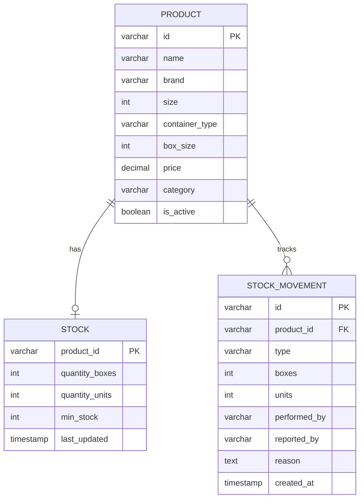

# 📊 Data Models (Production Implementation)

**Status:** ✅ Implemented in PostgreSQL  
**Migration Files:** `migrations/001_*.sql`, `migrations/002_*.sql`

---

## Design Philosophy

**KISS Principle:** Keep It Simple, Stupid

- One product per size/variant (no nested structures)
- Boxes + Units tracking (simple and clear)
- Audit trail for every movement (who did what)

---

## Product Model

### Schema

```sql
CREATE TABLE products (
    id VARCHAR(50) PRIMARY KEY,              -- "PROD-001", "PROD-002"
    name VARCHAR(255) NOT NULL,              -- "קוקה קולה 330 פחית"
    brand VARCHAR(100) NOT NULL,             -- "Coca Cola"
    size INTEGER NOT NULL CHECK (size > 0), -- 330 (ml), 1500 (ml)
    container_type VARCHAR(50) NOT NULL,     -- "can", "bottle", "bag"
    box_size INTEGER DEFAULT 0 CHECK (box_size >= 0),  -- 24, 6, null/0
    price DECIMAL(10,2) NOT NULL CHECK (price >= 0),   -- 45.00 NIS
    category VARCHAR(50) NOT NULL,           -- "drinks", "vegetables"
    is_active BOOLEAN DEFAULT TRUE,          -- Soft delete flag
    created_at TIMESTAMP DEFAULT CURRENT_TIMESTAMP,
    updated_at TIMESTAMP DEFAULT CURRENT_TIMESTAMP
);

-- Unique constraint: Brand + Size + ContainerType
CREATE UNIQUE INDEX idx_products_unique 
ON products (brand, size, container_type);

-- Performance indexes
CREATE INDEX idx_products_category ON products (category);
CREATE INDEX idx_products_active ON products (is_active);
```

### Go Model

```go
type Product struct {
    ID            string  // "PROD-001"
    Name          string  // "קוקה קולה 330 פחית"
    Brand         string  // "Coca Cola"
    Size          int     // 330 (ml)
    ContainerType string  // "can", "bottle", "bag"
    BoxSize       int     // 24, 6, 0 (if no box)
    Price         float64 // 45.00 (NIS)
    Category      string  // "drinks", "vegetables"
    IsActive      bool    // true
}
```

### Categories (MVP)

```go
const (
    CategoryDrinks     = "drinks"
    CategoryVegetables = "vegetables"
    CategoryBasics     = "basics"
    CategoryDairy      = "dairy"
    CategoryPackaging  = "packaging"
)

var CategoryNames = map[string]string{
    CategoryDrinks:     "משקאות",
    CategoryVegetables: "ירקות",
    CategoryBasics:     "מוצרים בסיסיים",
    CategoryDairy:      "מוצרי חלב",
    CategoryPackaging:  "אריזות",
}
```

### Examples

| ID | Name | Brand | Size | Container | BoxSize | Category |
|----|------|-------|------|-----------|---------|----------|
| PROD-001 | קוקה קולה קטנה | Coca Cola | 330 | can | 24 | drinks |
| PROD-002 | קוקה קולה גדולה | Coca Cola | 1500 | plastic | 6 | drinks |
| PROD-003 | עגבניות | - | 1000 | - | 0 | vegetables |
| PROD-004 | קמח | Five Stars | 1000 | bag | 0 | basics |

---

## Stock Model

### Schema

```sql
CREATE TABLE stocks (
    product_id VARCHAR(50) PRIMARY KEY,
    quantity_boxes INTEGER DEFAULT 0 CHECK (quantity_boxes >= 0),
    quantity_units INTEGER DEFAULT 0 CHECK (quantity_units >= 0),
    min_stock INTEGER DEFAULT 0 CHECK (min_stock >= 0),
    last_updated TIMESTAMP DEFAULT CURRENT_TIMESTAMP,
    FOREIGN KEY (product_id) REFERENCES products(id)
);

-- Index for low stock queries
CREATE INDEX idx_stocks_min ON stocks (min_stock);
```

### Go Model

```go
type Stock struct {
    ProductID     string
    QuantityBoxes int       // Full unopened boxes
    QuantityUnits int       // Loose items (from opened box)
    MinStock      int       // Alert threshold (in units)
    LastUpdated   time.Time
}

// TotalUnits calculates total inventory
func (s *Stock) TotalUnits(boxSize int) int {
    return (s.QuantityBoxes * boxSize) + s.QuantityUnits
}

// IsLowStock checks if reorder needed
func (s *Stock) IsLowStock(boxSize int) bool {
    return s.TotalUnits(boxSize) < s.MinStock
}
```

### Examples

| Product | Boxes | Units | BoxSize | Total | MinStock | Low? |
|---------|-------|-------|---------|-------|----------|------|
| Cola Small | 3 | 12 | 24 | 84 | 48 | ❌ |
| Cola Large | 1 | 3 | 6 | 9 | 12 | ✅ |
| Tomatoes | 0 | 5 | 0 | 5 kg | 10 | ✅ |

---

## Stock Movement Model

### Schema

```sql
CREATE TABLE stock_movements (
    id VARCHAR(50) PRIMARY KEY,
    product_id VARCHAR(50) NOT NULL,
    type VARCHAR(20) NOT NULL,               -- IN, OUT, WASTE, ADJUSTMENT
    boxes INTEGER DEFAULT 0,                 -- ±5
    units INTEGER DEFAULT 0,                 -- ±12
    performed_by VARCHAR(100) NOT NULL,      -- WHO did it
    reported_by VARCHAR(100) NOT NULL,       -- WHO logged it
    reason TEXT,                              -- Optional explanation
    created_at TIMESTAMP DEFAULT CURRENT_TIMESTAMP,
    FOREIGN KEY (product_id) REFERENCES products(id)
);

-- Performance indexes
CREATE INDEX idx_movements_product ON stock_movements (product_id);
CREATE INDEX idx_movements_type ON stock_movements (type);
CREATE INDEX idx_movements_created ON stock_movements (created_at DESC);
```

### Go Model

```go
type StockMovement struct {
    ID          string
    ProductID   string
    Type        string    // "IN", "OUT", "WASTE", "ADJUSTMENT"
    Boxes       int       // +5 or -2
    Units       int       // +10 or -3
    PerformedBy string    // WHO did the physical action
    ReportedBy  string    // WHO logged it in system
    Reason      string    // Optional
    CreatedAt   time.Time
}

// Movement types
const (
    MovementIn         = "IN"
    MovementOut        = "OUT"
    MovementWaste      = "WASTE"
    MovementAdjustment = "ADJUSTMENT"
)
```

### Examples

| ID | Product | Type | Boxes | Units | PerformedBy | ReportedBy | Reason |
|----|---------|------|-------|-------|-------------|------------|--------|
| MOV-001 | PROD-001 | IN | +5 | 0 | Owner | Owner | Delivery received |
| MOV-002 | PROD-001 | OUT | -1 | -5 | Yosef | Manager | Sold to customer |
| MOV-003 | PROD-003 | WASTE | 0 | -2 | Manager | Manager | Expired |
| MOV-004 | PROD-002 | ADJUSTMENT | 0 | +3 | Owner | Owner | Count correction |

### Who Tracking (IMPORTANT)

```
┌─────────────────────────────────────────────────────────────────┐
│                    TWO-PERSON TRACKING                          │
├─────────────────────────────────────────────────────────────────┤
│                                                                 │
│  performed_by: WHO physically did the action                   │
│  reported_by:  WHO entered it in the system                    │
│                                                                 │
│  Case 1: Manager logs that Yosef took items                    │
│  ├── performed_by: "Yosef"                                     │
│  └── reported_by: "Manager"                                    │
│                                                                 │
│  Case 2: Owner receives delivery themselves                    │
│  ├── performed_by: "Owner"                                     │
│  └── reported_by: "Owner" (same person)                        │
│                                                                 │
│  WHY? Accountability and audit trail                           │
│                                                                 │
└─────────────────────────────────────────────────────────────────┘
```

### Query Examples

```sql
-- All movements for a product
SELECT * FROM stock_movements 
WHERE product_id = 'PROD-001' 
ORDER BY created_at DESC;

-- What did Yosef take this week?
SELECT p.name, m.boxes, m.units, m.created_at
FROM stock_movements m
JOIN products p ON m.product_id = p.id
WHERE m.performed_by = 'Yosef'
  AND m.type = 'OUT'
  AND m.created_at > NOW() - INTERVAL '7 days';

-- Total waste this month (for analytics)
SELECT 
    p.category,
    SUM((m.boxes * p.box_size) + m.units) as total_wasted
FROM stock_movements m
JOIN products p ON m.product_id = p.id
WHERE m.type = 'WASTE'
  AND m.created_at >= DATE_TRUNC('month', NOW())
GROUP BY p.category;
```

---

## Entity Relationship Diagram



---

## Future Tables (Not Yet Implemented)

### Users (Phase 2)

```sql
CREATE TABLE users (
    id VARCHAR(50) PRIMARY KEY,
    email VARCHAR(255) UNIQUE NOT NULL,
    password_hash VARCHAR(255) NOT NULL,
    name VARCHAR(255) NOT NULL,
    role VARCHAR(20) NOT NULL,  -- 'owner', 'manager', 'employee'
    is_active BOOLEAN DEFAULT TRUE,
    created_at TIMESTAMP DEFAULT CURRENT_TIMESTAMP,
    updated_at TIMESTAMP DEFAULT CURRENT_TIMESTAMP
);
```

### Categories (Phase 2)

```sql
CREATE TABLE categories (
    id VARCHAR(50) PRIMARY KEY,
    name VARCHAR(100) NOT NULL,
    name_en VARCHAR(100),
    sort_order INTEGER DEFAULT 0,
    created_at TIMESTAMP DEFAULT CURRENT_TIMESTAMP
);
```

### Suppliers (Phase 3)

```sql
CREATE TABLE suppliers (
    id VARCHAR(50) PRIMARY KEY,
    name VARCHAR(255) NOT NULL,
    phone VARCHAR(50),
    email VARCHAR(255),
    notes TEXT,
    is_active BOOLEAN DEFAULT TRUE,
    created_at TIMESTAMP DEFAULT CURRENT_TIMESTAMP
);
```

---

## Best Practices

### ID Generation

```go
// Use simple sequential IDs for MVP
func GenerateProductID() string {
    // PROD-001, PROD-002, etc.
    return fmt.Sprintf("PROD-%03d", nextID)
}

// Later: Use UUIDs for distributed systems
// return uuid.New().String()
```

### Timestamps

- Always use UTC in database
- Convert to local timezone in frontend
- PostgreSQL: `TIMESTAMP` (not WITH TIME ZONE for simplicity)

### Soft Deletes

- Never DELETE products (breaks history)
- Use `is_active = FALSE` instead
- Filter inactive products in queries: `WHERE is_active = TRUE`

### NULL Handling

```go
// Go SQL package: use sql.NullString for nullable fields
type Product struct {
    Reason sql.NullString  // Can be NULL in database
}

// Check if value exists
if product.Reason.Valid {
    fmt.Println(product.Reason.String)
}
```

---

## Testing Data

### Seed Data for Development

```sql
-- Products
INSERT INTO products VALUES 
('PROD-001', 'קוקה קולה 330 פחית', 'Coca Cola', 330, 'can', 24, 45.00, 'drinks', TRUE, NOW(), NOW()),
('PROD-002', 'קוקה קולה 1.5L פלסטיק', 'Coca Cola', 1500, 'plastic', 6, 8.50, 'drinks', TRUE, NOW(), NOW()),
('PROD-003', 'עגבניות', 'Local', 1000, '', 0, 6.00, 'vegetables', TRUE, NOW(), NOW());

-- Stock
INSERT INTO stocks VALUES
('PROD-001', 5, 12, 48, NOW()),
('PROD-002', 2, 0, 12, NOW()),
('PROD-003', 0, 8, 10, NOW());

-- Movements
INSERT INTO stock_movements VALUES
('MOV-001', 'PROD-001', 'IN', 5, 0, 'Owner', 'Owner', 'Initial stock', NOW()),
('MOV-002', 'PROD-001', 'OUT', 0, 12, 'Owner', 'Owner', 'Sales', NOW());
```

---

## Summary

| Model | Status | Tables | Purpose |
|-------|--------|--------|---------|
| **Product** | ✅ Implemented | products | Catalog of items |
| **Stock** | ✅ Implemented | stocks | Current inventory levels |
| **Movement** | ✅ Implemented | stock_movements | Audit trail |
| **User** | ⬜ Future | users | Authentication |
| **Category** | ⬜ Future | categories | Organized grouping |
| **Supplier** | ⬜ Future | suppliers | Vendor management |

**Current Focus:** Get the core 3 models working perfectly before adding more complexity.
