# 📊 Updated Data Models (Final)

Based on design review discussions.

---

## Stock Movement - Updated

```sql
STOCK_MOVEMENT
├── id (UUID)                    -- Unique identifier
├── product_id (FK → Product)    -- What product
├── performed_by (FK → User)     -- WHO actually did the action (Yosef)
├── reported_by (FK → User)      -- WHO logged it (Manager)
├── type (enum)                  -- IN/OUT/WASTE/ADJUSTMENT
├── boxes_change (int)           -- +5 or -2
├── units_change (int)           -- +10 or -3
├── reason (string, nullable)    -- "Expired", "Damaged", etc.
├── notes (string, nullable)     -- Free text
└── created_at (timestamp)       -- When logged

-- Example:
-- Manager reports that Yosef took 2 boxes of cola
INSERT INTO stock_movements (
    product_id,
    performed_by,      -- Yosef's user_id
    reported_by,       -- Manager's user_id
    type,              -- 'OUT'
    boxes_change,      -- -2
    units_change,      -- 0
    notes              -- 'לקח לאירוע'
)
```

### Query Examples

```sql
-- Everything Yosef took this week
SELECT * FROM stock_movements 
WHERE performed_by = 'yosef_id' 
  AND type = 'OUT'
  AND created_at > NOW() - INTERVAL '7 days';

-- Who reported this suspicious movement?
SELECT u.name as reporter 
FROM stock_movements m
JOIN users u ON m.reported_by = u.id
WHERE m.id = 'movement_id';

-- Self-reported vs manager-reported
SELECT 
    CASE WHEN performed_by = reported_by THEN 'Self' ELSE 'Manager' END as report_type,
    COUNT(*) 
FROM stock_movements 
GROUP BY 1;
```

---

## Notification Queue - Persistent

```
┌─────────────────────────────────────────────────────────────────────────┐
│                    NOTIFICATION RELIABILITY                             │
├─────────────────────────────────────────────────────────────────────────┤
│                                                                         │
│  REQUIREMENT:                                                          │
│  If notification service is down, notifications should WAIT            │
│  and be sent when service is back up (not lost!)                       │
│                                                                         │
│  SOLUTION: Persistent Queue                                            │
│                                                                         │
│  Option A: Redis with AOF persistence                                  │
│  ├── Writes to disk every second                                       │
│  └── Survives restart                                                  │
│                                                                         │
│  Option B: PostgreSQL as queue (simpler)                               │
│  ├── notification_queue table                                          │
│  ├── status: pending/sent/failed                                       │
│  └── 100% persistent (it's in the database)                            │
│                                                                         │
│  FOR MVP: PostgreSQL queue (simpler, reliable)                         │
│  LATER: Redis/RabbitMQ if we need higher throughput                    │
│                                                                         │
└─────────────────────────────────────────────────────────────────────────┘
```

### Notification Queue Table

```sql
NOTIFICATION_QUEUE
├── id (UUID)
├── type (enum)               -- 'push' / 'whatsapp' / 'email'
├── recipient_id (FK → User)  -- Who should receive
├── title (string)            -- "מלאי נמוך"
├── body (text)               -- "קולה קטנה - נשארו 12 בקבוקים"
├── data (jsonb)              -- Additional data for the notification
├── status (enum)             -- 'pending' / 'sent' / 'failed'
├── attempts (int)            -- How many times we tried
├── last_attempt_at (timestamp)
├── sent_at (timestamp, null) -- When successfully sent
├── created_at (timestamp)
└── error (text, null)        -- Last error message if failed
```

### Flow

```
1. Stock becomes low
   ↓
2. Inventory Service creates notification in queue
   INSERT INTO notification_queue (status='pending', ...)
   ↓
3. Notification Service picks up pending notifications
   SELECT * FROM notification_queue WHERE status='pending'
   ↓
4. If send succeeds → status='sent', sent_at=NOW()
   If send fails → attempts++, status='pending' (retry later)
   If too many failures → status='failed', alert admin
```

---

## Full Data Model (Updated)

```mermaid
erDiagram
    CATEGORY {
        uuid id PK
        string name "משקאות"
        string name_en "Drinks"
        int sort_order
        timestamp created_at
        timestamp updated_at
    }
    
    PRODUCT {
        uuid id PK
        uuid category_id FK
        string name "קוקה קולה 330 פחית"
        string name_en "Coca Cola 330ml Can"
        string brand "Coca Cola"
        string size "330ml"
        string container_type "can/plastic/glass"
        string unit_type "bottle/kg/piece"
        int box_size "24 (nullable)"
        int default_expiry_days "365"
        int min_stock_level "48"
        text[] keywords "search keywords"
        boolean is_active "true"
        timestamp created_at
        timestamp updated_at
    }
    
    STOCK {
        uuid id PK
        uuid product_id FK
        int quantity_boxes
        int quantity_units
        date expiry_date "nullable"
        timestamp updated_at
    }
    
    STOCK_MOVEMENT {
        uuid id PK
        uuid product_id FK
        uuid performed_by FK "who did the action"
        uuid reported_by FK "who logged it"
        string type "IN/OUT/WASTE/ADJUSTMENT"
        int boxes_change
        int units_change
        string reason "nullable"
        string notes "nullable"
        timestamp created_at
    }
    
    USER {
        uuid id PK
        string email
        string phone
        string name
        string password_hash
        string role "owner/manager/employee"
        string language "he/en"
        boolean is_active
        timestamp created_at
        timestamp updated_at
    }
    
    NOTIFICATION_QUEUE {
        uuid id PK
        string type "push/whatsapp/email"
        uuid recipient_id FK
        string title
        text body
        jsonb data
        string status "pending/sent/failed"
        int attempts
        timestamp last_attempt_at
        timestamp sent_at
        timestamp created_at
        text error
    }
    
    SUPPLIER {
        uuid id PK
        string name
        string phone
        string email
        string contact_method "phone/app/whatsapp"
        decimal min_order_value
        text[] delivery_days
        text notes
        boolean is_active
        timestamp created_at
    }
    
    PRODUCT_SUPPLIER {
        uuid id PK
        uuid product_id FK
        uuid supplier_id FK
        decimal price_per_unit
        string unit_type "box/kg/piece"
        int min_quantity
        boolean is_preferred
        timestamp last_updated
    }

    CATEGORY ||--o{ PRODUCT : contains
    PRODUCT ||--o| STOCK : has
    PRODUCT ||--o{ STOCK_MOVEMENT : tracks
    USER ||--o{ STOCK_MOVEMENT : "performed_by"
    USER ||--o{ STOCK_MOVEMENT : "reported_by"
    USER ||--o{ NOTIFICATION_QUEUE : receives
    PRODUCT ||--o{ PRODUCT_SUPPLIER : "supplied by"
    SUPPLIER ||--o{ PRODUCT_SUPPLIER : supplies
```



---

## AI Conversation Flow - Updated

```
┌─────────────────────────────────────────────────────────────────────────┐
│  Manager: "יוסף לקח 2 ארגזים קולה גדולה"                                │
├─────────────────────────────────────────────────────────────────────────┤
│                                                                         │
│  AI Parse:                                                             │
│  ├── WHO: יוסף (employee name)                                         │
│  ├── ACTION: לקח (took = OUT)                                          │
│  ├── QUANTITY: 2 ארגזים (2 boxes)                                      │
│  └── PRODUCT: קולה גדולה (search products)                              │
│                                                                         │
│  AI Search Products:                                                   │
│  ├── Found: "קוקה קולה 1.5L פלסטיק" (in stock: 5 boxes)               │
│  └── Only one match for "קולה גדולה"                                    │
│                                                                         │
│  AI Confirm:                                                           │
│  "יוסף לקח 2 ארגזים קוקה קולה 1.5L פלסטיק. נכון?"                       │
│  [כן ✓] [לא, משהו אחר]                                                  │
│                                                                         │
│  Manager: [כן ✓]                                                        │
│                                                                         │
│  AI Action:                                                            │
│  INSERT INTO stock_movements (                                         │
│      product_id: 'cola-large-plastic-id',                              │
│      performed_by: 'yosef-user-id',    ← Yosef                        │
│      reported_by: 'manager-user-id',   ← The manager reporting        │
│      type: 'OUT',                                                      │
│      boxes_change: -2                                                  │
│  )                                                                      │
│                                                                         │
│  AI Response:                                                          │
│  "עדכנתי ✓ יוסף: -2 ארגזים קולה גדולה. נשארו 3 ארגזים במלאי."          │
│                                                                         │
└─────────────────────────────────────────────────────────────────────────┘
```

---

## Your Computer - Ollama Optimization

```
┌─────────────────────────────────────────────────────────────────────────┐
│                    OLLAMA ON OLD COMPUTER                               │
├─────────────────────────────────────────────────────────────────────────┤
│                                                                         │
│  SMALL MODELS (your computer can handle):                              │
│  ├── llama3.2:1b (1.3GB) ← Currently installed                        │
│  ├── phi3:mini (2.2GB)                                                 │
│  └── gemma2:2b (1.6GB)                                                 │
│                                                                         │
│  IF COMPUTER STRUGGLES:                                                │
│  ├── Use OpenAI API for development too                               │
│  ├── Cost: ~$1-5 per month for development                            │
│  └── Much faster responses                                             │
│                                                                         │
│  TIPS FOR OLD COMPUTER:                                                │
│  ├── Close other apps when using Ollama                                │
│  ├── Use smaller context (shorter conversations)                       │
│  └── Run: ollama run llama3.2:1b --verbose                            │
│      (see if it's using CPU or GPU)                                    │
│                                                                         │
│  CHECK YOUR SPECS:                                                     │
│  sysctl -n machdep.cpu.brand_string  ← CPU                            │
│  system_profiler SPHardwareDataType | grep Memory  ← RAM              │
│                                                                         │
└─────────────────────────────────────────────────────────────────────────┘
```

---

## ✅ Updated Understanding

| Requirement | Design Decision |
|-------------|-----------------|
| Track who did it vs who reported | `performed_by` + `reported_by` fields |
| Don't lose notifications | PostgreSQL queue with pending/sent/failed status |
| Old computer | Use small model (1b), can switch to OpenAI if needed |
| AI must understand context | Parse employee name, action, quantity, product |
| Always confirm before changing | AI asks for confirmation on every change |
