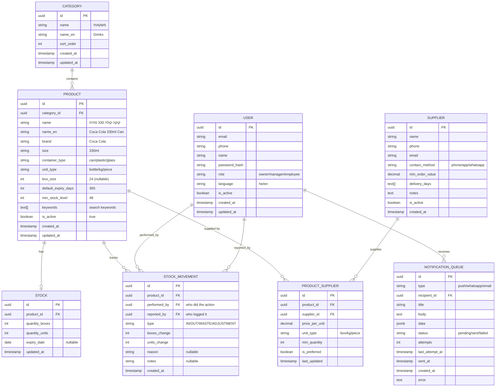

# 📊 Data Models (Production Implementation)

**Status:** ✅ Implemented in PostgreSQL
**Migration Files:** `migrations/001_*.sql`, `migrations/002_*.sql`

---

## Design Philosophy

**KISS Principle:** Keep It Simple, Stupid

- One product per size/variant (no nested structures)
- Boxes + Units tracking (simple and clear)
- Audit trail for every movement (who did what)

---

## Product Model

### Schema

```sql
CREATE TABLE products (
    id VARCHAR(50) PRIMARY KEY,              -- "PROD-001", "PROD-002"
    name VARCHAR(255) NOT NULL,              -- "קוקה קולה 330 פחית"
    brand VARCHAR(100) NOT NULL,             -- "Coca Cola"
    size INTEGER NOT NULL CHECK (size > 0), -- 330 (ml), 1500 (ml)
    container_type VARCHAR(50) NOT NULL,     -- "can", "bottle", "bag"
    box_size INTEGER DEFAULT 0 CHECK (box_size >= 0),  -- 24, 6, null/0
    price DECIMAL(10,2) NOT NULL CHECK (price >= 0),   -- 45.00 NIS
    category VARCHAR(50) NOT NULL,           -- "drinks", "vegetables"
    is_active BOOLEAN DEFAULT TRUE,          -- Soft delete flag
    created_at TIMESTAMP DEFAULT CURRENT_TIMESTAMP,
    updated_at TIMESTAMP DEFAULT CURRENT_TIMESTAMP
);

-- Unique constraint: Brand + Size + ContainerType
CREATE UNIQUE INDEX idx_products_unique 
ON products (brand, size, container_type);

-- Performance indexes
CREATE INDEX idx_products_category ON products (category);
CREATE INDEX idx_products_active ON products (is_active);
```

### Go Model

```go
type Product struct {
    ID            string  // "PROD-001"
    Name          string  // "קוקה קולה 330 פחית"
    Brand         string  // "Coca Cola"
    Size          int     // 330 (ml)
├── sent_at (timestamp, null) -- When successfully sent
├── created_at (timestamp)
└── error (text, null)        -- Last error message if failed
```

### Flow

```
1. Stock becomes low
   ↓
2. Inventory Service creates notification in queue
   INSERT INTO notification_queue (status='pending', ...)
   ↓
3. Notification Service picks up pending notifications
   SELECT * FROM notification_queue WHERE status='pending'
   ↓
4. If send succeeds → status='sent', sent_at=NOW()
   If send fails → attempts++, status='pending' (retry later)
   If too many failures → status='failed', alert admin
```

---

## Full Data Model (Updated)



---

## AI Conversation Flow - Updated

```
┌─────────────────────────────────────────────────────────────────────────┐
│  Manager: "יוסף לקח 2 ארגזים קולה גדולה"                                │
├─────────────────────────────────────────────────────────────────────────┤
│                                                                         │
│  AI Parse:                                                             │
│  ├── WHO: יוסף (employee name)                                         │
│  ├── ACTION: לקח (took = OUT)                                          │
│  ├── QUANTITY: 2 ארגזים (2 boxes)                                      │
│  └── PRODUCT: קולה גדולה (search products)                              │
│                                                                         │
│  AI Search Products:                                                   │
│  ├── Found: "קוקה קולה 1.5L פלסטיק" (in stock: 5 boxes)               │
│  └── Only one match for "קולה גדולה"                                    │
│                                                                         │
│  AI Confirm:                                                           │
│  "יוסף לקח 2 ארגזים קוקה קולה 1.5L פלסטיק. נכון?"                       │
│  [כן ✓] [לא, משהו אחר]                                                  │
│                                                                         │
│  Manager: [כן ✓]                                                        │
│                                                                         │
│  AI Action:                                                            │
│  INSERT INTO stock_movements (                                         │
│      product_id: 'cola-large-plastic-id',                              │
│      performed_by: 'yosef-user-id',    ← Yosef                        │
│      reported_by: 'manager-user-id',   ← The manager reporting        │
│      type: 'OUT',                                                      │
│      boxes_change: -2                                                  │
│  )                                                                      │
│                                                                         │
│  AI Response:                                                          │
│  "עדכנתי ✓ יוסף: -2 ארגזים קולה גדולה. נשארו 3 ארגזים במלאי."          │
│                                                                         │
└─────────────────────────────────────────────────────────────────────────┘
```

---

## Your Computer - Ollama Optimization

```
┌─────────────────────────────────────────────────────────────────────────┐
│                    OLLAMA ON OLD COMPUTER                               │
├─────────────────────────────────────────────────────────────────────────┤
│                                                                         │
│  SMALL MODELS (your computer can handle):                              │
│  ├── llama3.2:1b (1.3GB) ← Currently installed                        │
│  ├── phi3:mini (2.2GB)                                                 │
│  └── gemma2:2b (1.6GB)                                                 │
│                                                                         │
│  IF COMPUTER STRUGGLES:                                                │
│  ├── Use OpenAI API for development too                               │
│  ├── Cost: ~$1-5 per month for development                            │
│  └── Much faster responses                                             │
│                                                                         │
│  TIPS FOR OLD COMPUTER:                                                │
│  ├── Close other apps when using Ollama                                │
│  ├── Use smaller context (shorter conversations)                       │
│  └── Run: ollama run llama3.2:1b --verbose                            │
│      (see if it's using CPU or GPU)                                    │
│                                                                         │
│  CHECK YOUR SPECS:                                                     │
│  sysctl -n machdep.cpu.brand_string  ← CPU                            │
│  system_profiler SPHardwareDataType | grep Memory  ← RAM              │
│                                                                         │
└─────────────────────────────────────────────────────────────────────────┘
```

---

## ✅ Updated Understanding

| Requirement | Design Decision |
|-------------|-----------------|
| Track who did it vs who reported | `performed_by` + `reported_by` fields |
| Don't lose notifications | PostgreSQL queue with pending/sent/failed status |
| Old computer | Use small model (1b), can switch to OpenAI if needed |
| AI must understand context | Parse employee name, action, quantity, product |
| Always confirm before changing | AI asks for confirmation on every change |
