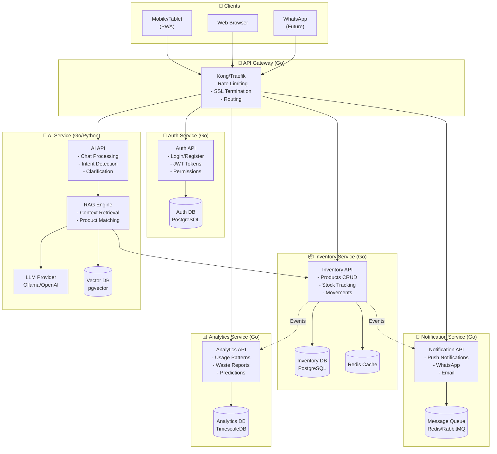
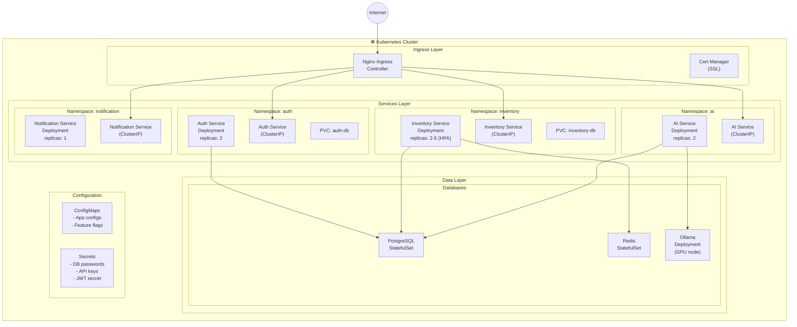
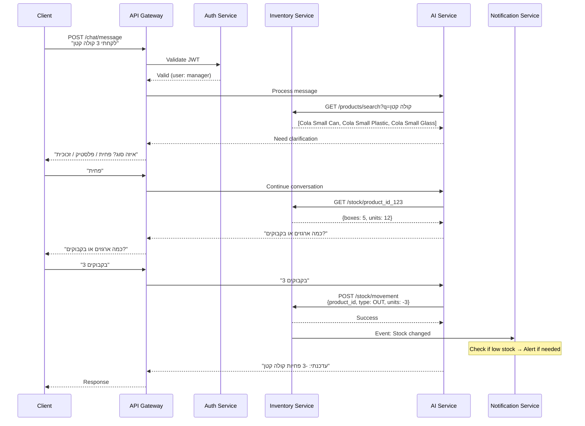
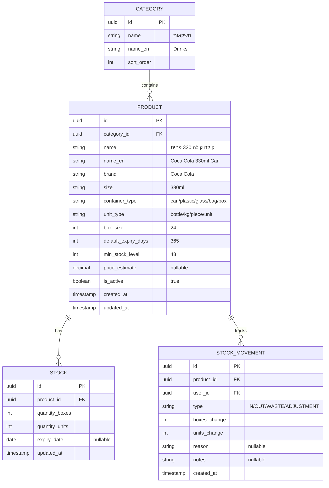
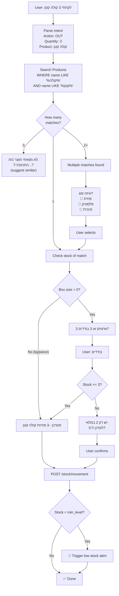

# 🏗️ Microservices Architecture

## System Overview



---

## Kubernetes Architecture



---

## Service Details

### 1. Auth Service
```yaml
Responsibility: User authentication and authorization
Port: 8081
Endpoints:
  POST /auth/login
  POST /auth/register
  POST /auth/refresh
  GET  /auth/me
  POST /auth/logout
  
Database Tables:
  - users (id, email, password_hash, role, employee_id)
  - refresh_tokens (id, user_id, token, expires_at)
  
K8s Resources:
  - Deployment (2 replicas)
  - Service (ClusterIP)
  - ConfigMap (jwt settings)
  - Secret (jwt secret, db password)
```

### 2. Inventory Service
```yaml
Responsibility: Products, stock, movements
Port: 8082
Endpoints:
  # Categories
  GET    /categories
  POST   /categories
  PUT    /categories/:id
  DELETE /categories/:id
  
  # Products
  GET    /products
  GET    /products/:id
  POST   /products
  PUT    /products/:id
  DELETE /products/:id
  GET    /products/search?q=cola
  GET    /products/low-stock
  GET    /products/expiring
  
  # Stock
  GET    /stock
  GET    /stock/:product_id
  POST   /stock/movement  (IN/OUT/WASTE/ADJUST)
  GET    /stock/movements?product_id=&from=&to=
  POST   /stock/sync      (bulk update)
  
Database Tables:
  - categories
  - products
  - stock
  - stock_movements
  - suppliers (future)
  
K8s Resources:
  - Deployment (2-5 replicas, HPA)
  - Service (ClusterIP)
  - HorizontalPodAutoscaler
  - PersistentVolumeClaim (for DB)
```

### 3. AI Service
```yaml
Responsibility: Natural language processing, chat
Port: 8083
Endpoints:
  POST /chat/message
  GET  /chat/history
  POST /chat/voice (audio input)
  
Internal Calls:
  → Inventory Service (get stock, products)
  → Notification Service (send alerts)
  
Components:
  - Intent Classifier
  - Entity Extractor (product names)
  - Clarification Engine
  - RAG for context
  
K8s Resources:
  - Deployment (2 replicas)
  - Service (ClusterIP)
  - ConfigMap (LLM settings)
  - Secret (OpenAI API key)
```

### 4. Notification Service
```yaml
Responsibility: Alerts and notifications
Port: 8084
Endpoints:
  POST /notify/push
  POST /notify/whatsapp
  POST /notify/email
  GET  /notify/preferences/:user_id
  PUT  /notify/preferences/:user_id
  
Event Listeners:
  - Low stock event → Send alert
  - Expiring soon event → Send alert
  - Large movement event → Send alert
  
K8s Resources:
  - Deployment (1-2 replicas)
  - Service (ClusterIP)
  - Secret (WhatsApp API, email creds)
```

### 5. Analytics Service (Future)
```yaml
Responsibility: Reports and predictions
Port: 8085
Endpoints:
  GET /analytics/usage?product_id=&period=
  GET /analytics/waste?period=
  GET /analytics/predictions
  GET /analytics/report/daily
  GET /analytics/report/weekly
```

---

## Inter-Service Communication



---

## Product Data Model (Revised)



---

## AI Clarification Flow



---

## Directory Structure (Microservices)

```
restaurant-inventory-ai/
├── services/
│   ├── auth/
│   │   ├── cmd/
│   │   │   └── server/
│   │   │       └── main.go
│   │   ├── internal/
│   │   │   ├── api/
│   │   │   ├── models/
│   │   │   ├── repository/
│   │   │   └── service/
│   │   ├── Dockerfile
│   │   ├── go.mod
│   │   └── go.sum
│   │
│   ├── inventory/
│   │   ├── cmd/
│   │   │   └── server/
│   │   │       └── main.go
│   │   ├── internal/
│   │   │   ├── api/
│   │   │   ├── models/
│   │   │   ├── repository/
│   │   │   └── service/
│   │   ├── Dockerfile
│   │   ├── go.mod
│   │   └── go.sum
│   │
│   ├── ai/
│   │   ├── cmd/
│   │   │   └── server/
│   │   │       └── main.go
│   │   ├── internal/
│   │   │   ├── api/
│   │   │   ├── chat/
│   │   │   ├── intent/
│   │   │   ├── rag/
│   │   │   └── llm/
│   │   ├── Dockerfile
│   │   ├── go.mod
│   │   └── go.sum
│   │
│   └── notification/
│       ├── cmd/
│       │   └── server/
│       │       └── main.go
│       ├── internal/
│       │   ├── api/
│       │   ├── whatsapp/
│       │   ├── push/
│       │   └── email/
│       ├── Dockerfile
│       ├── go.mod
│       └── go.sum
│
├── shared/
│   └── pkg/
│       ├── auth/        (JWT validation)
│       ├── errors/      (common errors)
│       ├── logger/      (structured logging)
│       └── middleware/  (common middleware)
│
├── deployments/
│   └── k8s/
│       ├── base/
│       │   ├── namespace.yaml
│       │   ├── auth/
│       │   ├── inventory/
│       │   ├── ai/
│       │   └── notification/
│       ├── overlays/
│       │   ├── dev/
│       │   └── prod/
│       └── kustomization.yaml
│
├── docker-compose.yaml  (local development)
├── Makefile
└── docs/
    ├── ARCHITECTURE.md
    ├── REQUIREMENTS.md
    └── DECISIONS.md
```

---

## Development Plan (Updated)

### Phase 1: Foundation (Weeks 1-3)
Learn Go + Build Inventory Service core
- Go fundamentals
- Product/Category/Stock models
- Basic CRUD APIs
- PostgreSQL setup
- Docker container

### Phase 2: Auth Service (Week 4)
- User model
- JWT authentication
- Role-based access
- Service-to-service auth

### Phase 3: Docker & Local Dev (Week 5)
- Dockerize both services
- docker-compose for local
- Service communication
- Shared database vs separate DBs

### Phase 4: Kubernetes Basics (Weeks 6-7)
- Deploy to local K8s (minikube/kind)
- Deployments, Services, ConfigMaps
- Ingress setup
- Basic monitoring

### Phase 5: AI Service (Weeks 8-10)
- Chat endpoint
- Ollama integration
- Intent detection
- Product search & matching
- Clarification flow

### Phase 6: Notification Service (Week 11)
- Alert triggers
- WhatsApp integration
- Event-driven architecture

### Phase 7: Production Ready (Week 12+)
- HPA (auto-scaling)
- Health checks
- Logging & monitoring
- CI/CD pipeline
